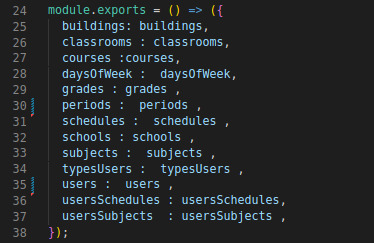
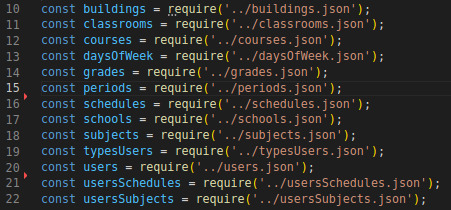
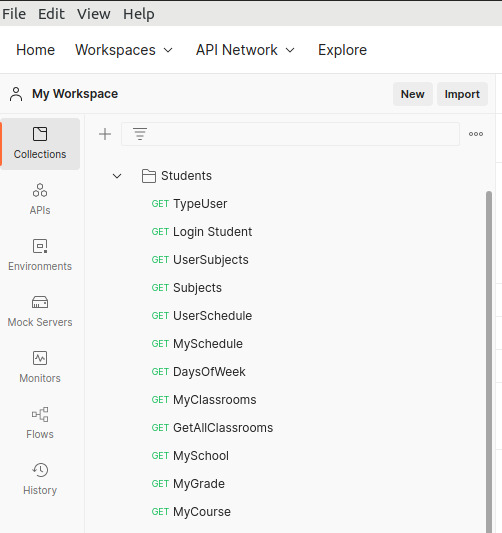
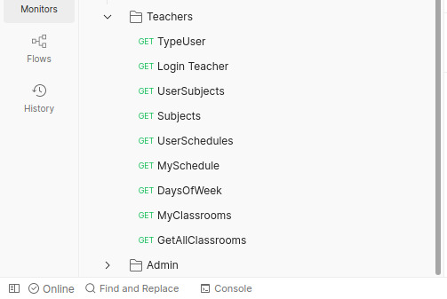
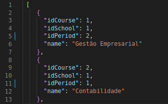

# Construção da API (Application Programming Interface) do IPCA apartir do JSON Server

## JSON Server

JSON-server é um dos pacotes do npm (Node Package Manager). O npm é o gerenciador nativo da linguagem Javascript, usado no ambiente de execução Node.js. 
Este servidor fica responsável pela simulação de uma API REST com todos os endpoints e os metodos: GET, POST, PUT e DELETE, abstraindo-se da sua implementação, facilitando muito durante a realização de testes durante o período de desenvolvimento de uma aplicação Web principalmente, no front-end.

## Problemas a resolver

É de conhecimento geral que criar uma API não é algo fácil e nem mesmo barato. Criar uma API é um processo morroso. Tendo em conta que queremos construir um sitema para o IPCA, realizar investigações sobre o processamento e o armazenamento dos dados do IPCA, é inviável devido aos riscos e demais problemas que isto pode acarretar.

Justamente para resolver este problema, foi criada a simulação  do servidor do IPCA para testar cada requisição e troca de informações entre o servidor do IPCA e o servidor do Smart Rooms.

Em suma o módulo JSON-server atua na criação, de uma simulação de serviços REST, apartir de ficheiros JSON, eliminando a necessidade de programar toda uma API para realizar testes no backend ou frontend.

## Script para JSON Server

Para a inicialização do servidor local com ficheiros JSON's com intuito de simular a API do IPCA é necessário fazer um script que aponte para os ficheiros que serão disponibilizados pelo servidor.

* *Figura 1 - excerto de codigo que permite correr o servidor Json*

* *Figura 2*

## Postman collections

O Postman é uma ferramenta para fazer requisições HTTP e as coleções Postman ajudam a organizar e agrupar requisições de uma API. Para este projeto foi criado uma coleção denominada Smart Rooms que possui dois diretório, um denominado Students que contém as requisições que serão feitas pelo utilizador aluno e o outro denominado Teachers que contém as requisições que serão feitas pelo utilizador do tipo professor, conforme demostrado na figura 3 e 4.

Através do módulo JSON-server será uma requisição por meio do postman que nos mostrará as informações disponíveis no ficheiro JSON que construimos, anteriormente.

* *Figura 3 - diretório das requisições do aluno no postman*

* *Figura 4 - diretório das requisições do professor no postman*

## Criação de ficheiros json

Foram criados 12 ficheiros jsons para simulação da api nomeadamente:

* buildings - Representa uma tabela que contém os dados dos diferentes polos existentes do IPCA
* schools - As Escolas dos diferentes polos do IPCA
* classrooms - As salas pertecentes as escolas
* periods - Periodo de aulas (laboral e pós laboral)
* courses - Cursos do IPCA
* grades - Anos dos cursos (1º ano, 2ºano, 3º ano)
* daysOfWeek - Dias da semana
* usersSchedules -  Tabela que relaciona os utlizadores com os seus respetivos horários
* schedules - Horário
* subjects - Unidades curriculares
* usersSubjects - Tabela que relaciona os utilizadores com as suas unidades curriculares
* typesUsers -tipos de utilizadores
* users - utilizadores

Na figura 2 e 3, está um excerto de código que mostra alguns dos dados criados para as turmas e para os cursos:

* *Figura 5  - criação dos dados das salas*

* *Figura 6 - criação dos dados dos cursos*

## Bibliografia

https://www.alura.com.br/artigos/mockando-apis-rest-com-json-server